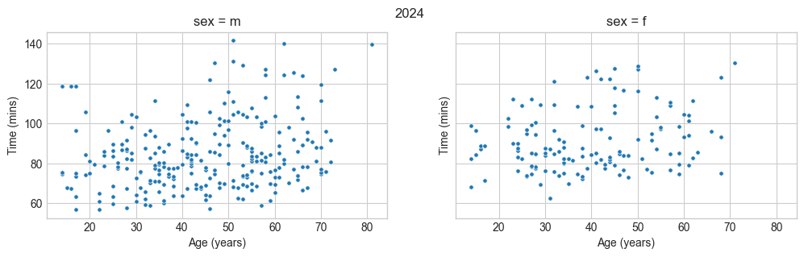
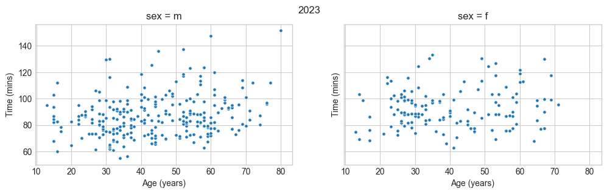
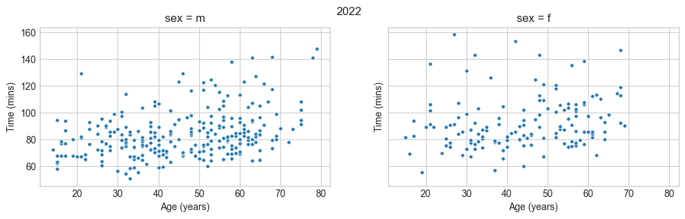

# TOBAY triathlon data

Scraping data from the Town of Oyster Bay triathlon.

I mainly wanted to know how strong the effect of age was on chip time.

BeautifulSoup, Selenium and pandas are used for the scraping / munging. Snakemake is used to stitch
everything together.

The 2022 data has a bunch of additional tables that I removed from `csv/2022-main.csv` by hand.

Results from 2022-2024 are listed[here](https://runsignup.com/Race/Results/131115#resultSetId-482363;perpage:5000).

